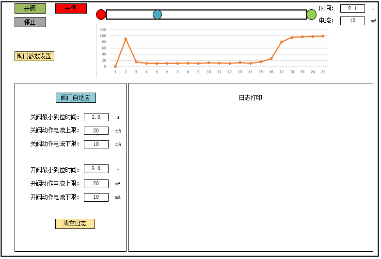
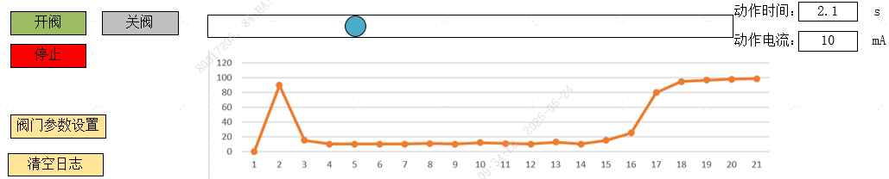
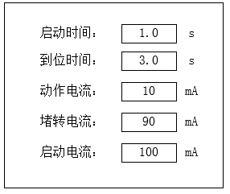
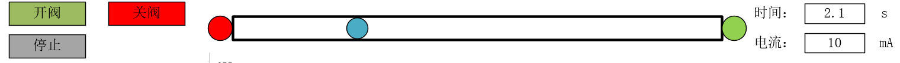
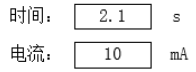
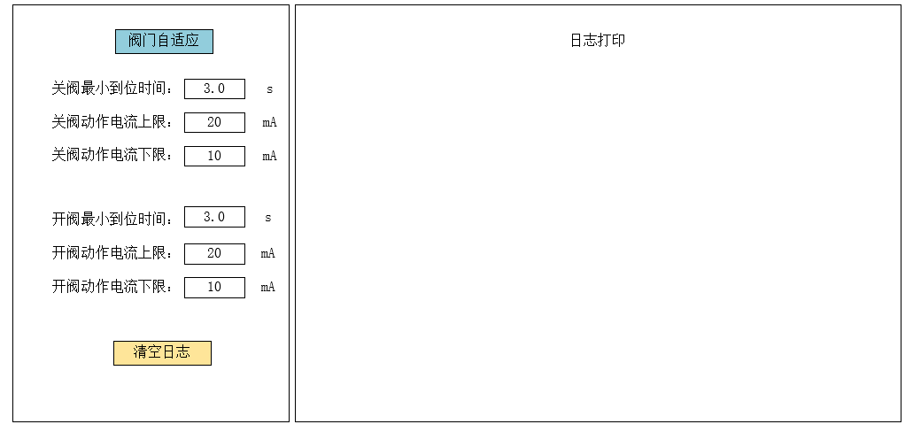
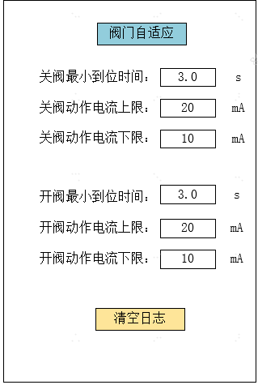
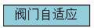

**开发对象**：一个可以模拟阀门动作的基于C/C++、qt的运行在windows10操作系统窗口程序

**开发背景**：

1、阀门的开与关的过程中，有行程时间和动作电流，开发一个虚拟阀门来模拟真实阀门在动作过程中的产生的时间和电流信号。不同的阀门行程时间和动作电流不一样，通过设置阀门的时间、电流参数来模拟不同的阀门，并通过图形界面来展示阀门的动作过程以及过程中的时间、电流数据。

2、方便后期编写测试程序，来操作虚拟阀门动作，读取虚拟阀门的动作过程中的电流、时间数据，输出测试数据。不再需要真实的阀门来通过MCU控制阀门，测试不同阀门

**界面设计：窗口右上角提供最小化、放大/缩小、关闭按钮**

**窗口设计风格描述：**

1、最终效果类似 **Qt Creator** 或 **Visual Studio Code** 的自定义标题栏风格——窗口四角为大圆角（20px），右上角为红黄绿三色圆点按钮，标题居中，窗口带有柔和外阴影。标题栏高度 48px，背景为半透明白色（浅色模式）或深灰色（深色模式），与内容区域之间有 1px 细分割线。所有控件均为扁平化设计，无 Windows 原生边框痕迹。

2、操作按钮：务必使用 **带有边框凹陷/凸起视觉（Sunken/Raised）** 的3D边框效果，给操作者清晰的“可点击”物理暗示。

**程序业务逻辑描述：**

一、虚拟阀门动作界面：

（一）点击<阀门参数设置>，弹窗出现阀门参数设置界面

时间参数保留小数点后一位，单位为秒（s),电流参数单位为毫安（mA)，默认参数如图所示

1.参数介绍

（1）启动时间:阀门在启动后，在启动时间内，电流会攀升至【启动电流】值，在启动时间结束时回落至【动作电流】值

（2）到位时间:阀门从[开到位]至[关到位]或者从[关到位]至[开到位]所需要的时间

（3）动作电流：阀门在【启动时间】结束后，在开到位或者关到位之前的【动作电流】

（4）堵转电流：在开到位或者关到位时的（电流）

（5）启动电流：在启动时间内，阀门电流攀升的峰值电流

2、窗口右上角提供关闭按钮

(二)虚拟阀门展示界面以及相关按钮功能介绍

1、蓝色小圆球所在的方框代表阀门的行程路径：

（1）蓝色小球代表阀门当前的位置，最左边代表[关到位]的位置，最右边代表[开到位]的位置，蓝色小球到达最左或者最右后停止

（2) 红色小球代表关到位信号灯，当蓝色小球到达[关到位]位置时，关到位信号灯亮起为红色，

（3) 绿色小球代表开到位信号灯，当蓝色小球到达[开到位]位置时，开到位信号灯亮起为绿色

（4) 其余时候为信号灯均为熄灭状态，熄灭状态为灰色

（5）完整行程所花费的时间为【到位时间】，到达[开到位]或者[关到位后，（电流）攀升至【堵转电流】

2、点击`<开阀> <关阀> <停止>`，阀门行为描述

（1）点击`<开阀>`,阀门启动，蓝色小球从当前位置从左向右行进至最右侧的[开到位]位置停下来

（2）点击`<关阀>`,阀门启动，蓝色小球从当前位置从右向左行进至最左侧的[关到位]位置停下来

（3）点击`<停止>`,阀门停止，蓝色小球从停留在当前位置

（4）只要点击`<开阀>`或者`<关阀>`，阀门都要经历【启动时间】

（5）需要为我暴露这三个操作按钮的函数操作接口，方便我调用操作阀门动作

3、当前阀门动作的时间和电流展示

（1）（时间）用来展示当前的阀门动作的时间，（电流）用来展示当前的阀门的电流

（2）只要点击`<开阀>`或者`<关阀>`,时间就从0开始，以0.1秒为单位开始计时

（3）只要点击`<停止>`，阀门立即停止，并且停止计时，（电流）变为0mA

（4）需要为我暴露（时间）、（电流）数据的函数读接口，方便我调用读取阀门数据

4、基于阀门动作时间、电流的波形图示例

（1）通过统计阀门动作（时间）点的（电流）值，来展示时域的电流

（2）纵坐标为电流值，精度为1mA，最大值根据电流值实时调整，；横坐标为时间，精度为0.1秒，最大值为10.0秒

（2）点击`<开阀>`或者`<关阀>`时，刷新波形图，依据（时间）和（电流）开始绘制；点击`<停止>`，停止绘制

(三)虚拟阀门展示界面操作流程示例

示例1：点击`<开阀>`，阀门启动，蓝色小球从当前位置开始自左向右行进，（时间）开始从0计时，在启动时间内，（电流）先从0mA攀升至【启动电流】，然后在启动时间结束时，回落至【动作电流】，在到达[开到位]时，蓝色小球停下来，开到位信号灯亮起绿光，（电流）会在0.3秒时间内攀升至【堵转电流】，点击`<停止>`，（时间）停止计时，（电流）变为0mA

示例1：点击`<开阀>`，阀门启动，蓝色小球从当前位置开始自左向右行进，（时间）开始从0计时，在启动时间内，（电流）先从0mA攀升至【启动电流】，然后在启动时间结束时，回落至【动作电流】，在未到达[开到位]时，点击`<停止>`，蓝色小球停下来，（时间）停止计时，（电流）变为0mA，蓝色小球停下来，因为未到达[开到位]，所以开到位信号灯不亮

二、用户阀门测试程序展示界面

这个界面用于我来开发阀门控制程序的操作展示界面，我的开发语言为C语言

（一）测试程序数据输出界面

1、

该按钮关联我后续自行编写的测试程序，点击该按钮后，调用我后续开发的测试程序

2、该界面需要为我暴露（关阀小到位时间）、（关阀动作电流上限）、（关阀动作电流下限）

（开阀小到位时间）、（开阀动作电流上限）、（开阀动作电流下限）数据展示的函数写接口，方便我调用输出数据

（二）测试程序日志打印界面

该界面用来我后续编写测试程序的信息打印输出

1、需要为我暴露该界面的输出打印接口

2、

点击该按钮用来清空打印的日志

